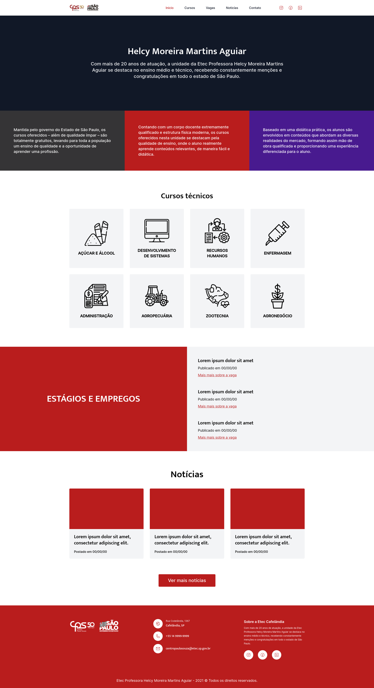

p align="center">
  <a href="#-Technologies">
Technologies</a>&nbsp;&nbsp;&nbsp;|&nbsp;&nbsp;&nbsp;
  <a href="#-Project">Project</a>&nbsp;&nbsp;&nbsp;|&nbsp;&nbsp;&nbsp;
  <a href="#-Layout">Layout</a>&nbsp;&nbsp;&nbsp;|&nbsp;&nbsp;&nbsp;

 

  

## 🚀 Technologies

This project was developed with the following technologies:

- React
- TalwindCSS
- React Router
- AnimateOnScroll

Libraries

- [Google Fonts](https://fonts.google.com/)

## 💻 Project

Page made to improve knowledge in React

## 🔖 Layout

You can view the project layout through [this link](https://www.figma.com/file/Yb9IBH56g7T1hdIyZ3BMNO/Desafios---Codel%C3%A2ndia?node-id=163987%3A4183&t=u3rPeXhRfDR0LH5l-0). You must have an account at [Figma](https://figma.com) to access it.
